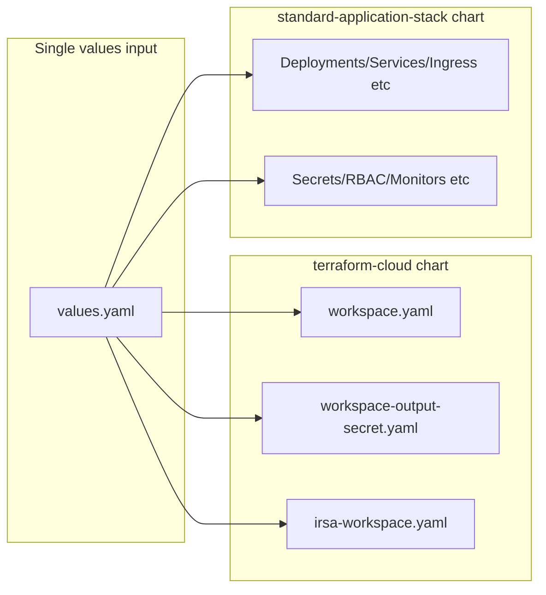

# Values and Effects Report: Helm Charts → CUE Feature Parity

This report documents all values in both charts' `values.yaml` files and what changing each value affects, so a CUE-based replacement can achieve full feature parity when the same values are passed into both charts and manifests are rendered into a single folder.

**Section 6** defines a **feature-oriented documentation spec**: a comprehensive list of user-facing features to document, with the variables and logic to describe for each. The full detailed spec is in [docs/feature-documentation-spec.md](docs/feature-documentation-spec.md).

---

## 1. How the two charts are used together

- **Same values**: A Tanka-based repo passes the **same** values into both charts and writes all manifests to one folder.
- **terraform-cloud** ([charts/terraform-cloud/values.yaml](charts/terraform-cloud/values.yaml)): Renders Terraform Cloud Workspace/Module CRs and (when `global.terraform.externalSecrets` is true) ExternalSecrets for workspace outputs and optional IRSA output.
- **standard-application-stack** ([charts/standard-application-stack/values.yaml](charts/standard-application-stack/values.yaml)): Renders Kubernetes app workload (Deployments/StatefulSets, Services, Ingress, Jobs, CronJobs, RBAC, secrets, monitors, etc.).
- **Shared `global`**: Both charts consume `global` (e.g. `name`, `owner`, `partOf`, `clusterEnv`, `clusterRegion`, `clusterName`). Terraform-cloud also uses `global.terraform.*` and `global.backstage`; standard-application-stack uses `global.application`, `global.component`, `global.cloudProvider`, `global.terraform.externalSecrets` / `irsa`, `global.additionalLabels`, `global.runtimeEnvironment`, `global.ingressTLSSecrets`. For CUE, define one shared `global` schema and have both chart outputs consume it.

---

## 2. Terraform-cloud chart: values and effects

**Templates**: [workspace.yaml](charts/terraform-cloud/templates/workspace.yaml), [workspace-output-secret.yaml](charts/terraform-cloud/templates/workspace-output-secret.yaml), [irsa-workspace.yaml](charts/terraform-cloud/templates/irsa-workspace.yaml), plus helpers [_helpers.tpl](charts/terraform-cloud/templates/_helpers.tpl), [_workspace-v2.yaml](charts/terraform-cloud/templates/helpers/_workspace-v2.yaml), [_module_v2.yaml](charts/terraform-cloud/templates/helpers/_module_v2.yaml), [_workspace-output-secret.yaml](charts/terraform-cloud/templates/helpers/_workspace-output-secret.yaml).

### 2.1 Global

| Value path | Effect |
|------------|--------|
| `global.name` | Fullname (when no `nameOverride`/component), instance naming, labels, default tags (Application/Component). |
| `global.owner` | Labels, default tags (Owner), workspace annotations (terraform-owner). |
| `global.partOf` | Default tags (Project). |
| `global.clusterEnv` | Labels, default tags (env), `allow_destroy` default (prod/logs → false), env-based defaultVarValues (RDS, DynamoDB, OpenSearch, Redis, S3). |
| `global.clusterName` | Used in IRSA vars when provided. |
| `global.clusterRegion` | Labels, instance naming. |
| `global.backstage.component` | Default tags (`backstage.io/component`) when `global.terraform.tags.addBackstageComponentTag` is true. |
| `global.terraform.organization` | Workspace spec (Terraform Cloud org). |
| `global.terraform.terraformVersion` | Default Terraform version for all modules. |
| `global.terraform.externalSecrets` | **Gate**: when true, workspace-output-secret.yaml renders ExternalSecrets for workspace outputs and optional IRSA secret. |
| `global.terraform.irsa` | Consumed by standard-application-stack for IRSA annotation; not used in terraform-cloud templates directly. |
| `global.terraform.agentPoolID` | Workspace agent pool. |
| `global.terraform.executionMode` | Workspace execution mode (e.g. agent). |
| `global.terraform.enableRestartedAt` | Module CR: include restartedAt for plan/apply triggers. |
| `global.terraform.restartedAt` | Module CR: explicit restartedAt value when set. |
| `global.terraform.defaultWorkspaceAllowDestroy` | Default for allow_destroy when not set per instance. |
| `global.terraform.defaultApplyMethod` | Default apply method (e.g. auto). |
| `global.terraform.teamAccess` | Workspace team access block when set. |
| `global.terraform.tags.addBackstageComponentTag` | Include backstage tag in default tags. |
| `global.terraform.tags.addDeprecatedTags` | Include Owner, Project, Application, Component in default tags. |

### 2.2 Root-level

| Value path | Effect |
|------------|--------|
| `nameOverride` | Fullname in helpers when set (overrides `global.name` for name when no component). |

### 2.3 Resource blocks (same pattern for each)

For each key in `terraformCloudResources`: **activeMQ**, **apiGatewayHttp**, **auroraMySql**, **auroraPostgresql**, **cmsBackup**, **datasync**, **dynamodb**, **extraIAM**, **glue**, **kinesis-firehose**, **lambda**, **mariadb**, **memcached**, **opensearch**, **postgresql**, **redis**, **s3**, **s3ReplicationRules**, **s3MultiRegionAccessPoint**, **sns**, **sqs**, **sshKeyPairSecret**, **staticWebsite**, **stepFunctionEks**.

| Value path | Effect |
|------------|--------|
| `<resource>.enabled` | **Gate**: when true, workspace.yaml emits one Workspace CR + one Module CR per instance. For opensearch, s3, s3MultiRegionAccessPoint, dynamodb, sns, sqs also drives `irsaRequired` (irsa-workspace.yaml rendered when true). |
| `<resource>.outputSecret` | When true and `global.terraform.externalSecrets`, workspace-output-secret.yaml emits ExternalSecret(s) for that resource's outputs. |
| `<resource>.syncWave` | ArgoCD sync wave on Workspace CR (optional). |
| `<resource>.eventBus.enabled` | (SNS/SQS) Event bus tag/behavior when set. |
| `<resource>.terraform.terraformVersion` | Override Terraform version for this module. |
| `<resource>.terraform.module.source` | Module registry path. |
| `<resource>.terraform.module.version` | Module version. |
| `<resource>.terraform.defaultVars` | Default TF variables for all instances. |
| `<resource>.terraform.instances` | Map of instance name → vars; one Workspace+Module per entry (or single default). Keys (workspaceNameOverride, workspaceTags, workspaceAllowDestroy, workspaceApplyMethod, moduleDestroyOnDeletion, workspaceOwner, outputSecretMap, plus module-specific vars) flow into Workspace annotations and Module vars. |

### 2.4 IRSA

| Value path | Effect |
|------------|--------|
| `irsa.enabled` | **Gate**: when true, irsa-workspace.yaml renders IRSA Workspace + Module CR even if no other IRSA resource is enabled. |
| `irsa.terraform.*` | Module source/version, terraformVersion, vars, notifications, nameOverride. |
| `irsa.terraform.vars` | Full vars for IRSA workspace; `output_secret_name` when set (and externalSecrets true) triggers one ExternalSecret for IRSA output. |
| `jobs` | List of job names used to build `k8s_extra_service_accounts` for IRSA (e.g. `global.name` + job name). |
| `s3MultiRegionAccessPoint.enabled` + `s3MultiRegionAccessPoint.terraform.instances` | When IRSA is rendered, injects `lookup_multi_region_access_points` into IRSA vars. |

### 2.5 Conditional manifest summary (terraform-cloud)

| Manifest | Condition |
|----------|-----------|
| Workspace + Module CRs per resource | `.<resource>.enabled` (each resource type). |
| ExternalSecrets (workspace outputs) | `global.terraform.externalSecrets` and `.<resource>.enabled` and `.<resource>.outputSecret`. |
| IRSA Workspace + Module | `irsa.enabled` **or** any of opensearch, s3, s3MultiRegionAccessPoint, dynamodb, sns, sqs `.enabled`. |
| IRSA ExternalSecret | `global.terraform.externalSecrets` and `irsa.terraform.vars.output_secret_name` set. |

---

## 3. Standard-application-stack chart: values and effects

**Templates**: 40+ files under [templates/](charts/standard-application-stack/templates/) and [templates/helpers/](charts/standard-application-stack/templates/helpers/).

### 3.1 Global and identity

| Value path | Effect |
|------------|--------|
| `global.name` | Fullname, labels, selector labels, default application/component. |
| `global.owner` | Labels (app.mintel.com/owner). |
| `global.application` / `global.component` | Labels (defaults to global.name). |
| `global.partOf` | Selector label app.kubernetes.io/part-of. |
| `global.additionalLabels` | Merged into common labels. |
| `global.clusterEnv` | Labels, env (RUNTIME_ENVIRONMENT), "local" vs non-local behavior: secrets backend, network policy, VPA, monitors, Entra. |
| `global.clusterRegion` | Labels, env (CLUSTER_REGION). |
| `global.terraform.externalSecrets` | When true, standard-application-stack does **not** create AWS ExternalSecrets for backends; terraform-cloud does. |
| `global.terraform.irsa` | When true, service account gets EKS IRSA annotation from terraform-cloud-created IAM. |
| `nameOverride` | Overrides fullname (trunc 63). |
| `partOf` / `component` | Override global for selector/component label. |
| `additionalLabels` | Merged into labels (root-level). |

### 3.2 Workload: deployment / statefulset

| Value path | Effect |
|------------|--------|
| `replicas` | Deployment/StatefulSet spec when not autoscaling; PDB and topology spread when not autoscaling. |
| `minReadySeconds` | Deployment only (not StatefulSet). |
| `statefulset` | StatefulSet vs Deployment; volumeClaimTemplates; pvcs.yaml skipped when true. |
| `singleReplicaOnly` | Replicas forced to 1; no PDB; strategy Recreate; OPA annotation opa-allow-single-replica. |
| `allowSingleReplica` | OPA annotation opa-allow-single-replica; allows replicas=1 with RollingUpdate. |
| `image` / `imagePullSecrets` | Container image and pull policy (all deployments, jobs, cronjobs). |
| `port` / `extraPorts` | Container ports; service; ingress/network-policy. |
| `command` / `args` / `env` / `main.env` / `envFrom` | Main container config. |
| `resources` / `securityContext` / `podSecurityContext` | Container and pod security/resources. |
| `liveness` / `readiness` / `terminationGracePeriodSeconds` | Probes and grace period; OPA skip annotations when probes disabled. |
| `strategy` | Deployment update strategy; singleReplicaOnly forces Recreate. |
| `topologySpreadConstraints` / `affinity` | Spread and anti-affinity (see feature doc for conditions). |
| `extraInitContainers` / `extraContainers` | Init and sidecar containers. |
| `volumes` / `volumeMounts` / `persistentVolumes` | Volumes and PVCs. |
| `cronjobsOnly` / `jobsOnly` | Hide main Deployment/StatefulSet, Service, main PDB, main VPA, main ServiceMonitor. |

### 3.3 Service, ingress, NLB

| Value path | Effect |
|------------|--------|
| `service.enabled` | Service resource; when false, PodMonitor instead of ServiceMonitor when metrics enabled. |
| `ingress.enabled` | Ingress resource(s); tier=frontend label when enabled or allowFrontendAccess. |
| `ingress.tls` / `defaultHost` / `extraHosts` / `extraIngresses` / `ingress.alb` | Hosts, TLS, ALB annotations, API gateway conditions when scheme=api. |
| `ingress.allowFrontendAccess` | tier: frontend label without ingress. |
| `nlb.enabled` | Service type LoadBalancer with NLB annotations. |
| `networkPolicy.enabled` | NetworkPolicy when not local. |

### 3.4 Probes, PDB, autoscaling, VPA

| Value path | Effect |
|------------|--------|
| `podDisruptionBudget.*` | PDB when enabled and replicas/minReplicaCount > 1; celery PDB separately. |
| `autoscaling.enabled` | KEDA ScaledObject when not local; **replicas field omitted** from Deployment/StatefulSet. |
| `autoscaling.*` | min/max, triggers, Mimir, enableZeroReplicas, fallback, etc. |
| `verticalPodAutoscaler.*` | VPA per workload when not local and not cronjobsOnly/jobsOnly. |

### 3.5 Service account, RBAC, kubelock

| Value path | Effect |
|------------|--------|
| `serviceAccount.*` | ServiceAccount, Roles, ClusterRoles, bindings when create true. |
| `kubelock.enabled` | Kubelock Role + RoleBinding when serviceAccount.create. |

### 3.6 Secrets and backends

| Value path | Effect |
|------------|--------|
| `externalSecret.*` / `extraSecrets` | Main app ExternalSecret; local Secret in local env. |
| `mariadb` / `postgresql` / `redis` / `s3` / `dynamodb` / `sqs` / `elasticsearch` / `opensearch` / `oauthProxy` | Secret refs in deployment; ExternalSecrets when not global.terraform.externalSecrets; client/metrics/extraUsers/awsEsProxy as configured. |

### 3.7 Celery, cronjobs, jobs

| Value path | Effect |
|------------|--------|
| `celery.*` / `celeryBeat.*` | Celery worker, beat, exporter deployments; PDB; monitors; VPA. |
| `cronjobs.jobs` / `cronjobs.defaults` | CronJob list; enableDoNotDisrupt → karpenter.sh/do-not-disrupt on pod template. |
| `jobs` / `jobDefaults` | Job list; enableDoNotDisrupt per job or default. |

### 3.8 Observability, sidecars, Entra, configmaps

| Value path | Effect |
|------------|--------|
| `metrics.*` | ServiceMonitor or PodMonitor when not local. |
| `otel.*` | OTEL env injection. |
| `filebeatSidecar` / `gitSyncSidecar` / `localstack` / `mailhog` / `eventBus` | Sidecars and env. |
| `entra.*` | Entra CRs; ALB RBAC; optional client secrets in workload. |
| `configMaps` | ConfigMap resources and reload annotations. |

### 3.9 Conditional manifest summary (standard-application-stack)

- **Main Deployment/StatefulSet**: not when `cronjobsOnly` or `jobsOnly`.
- **Service**: `service.enabled` and not cronjobsOnly/jobsOnly.
- **Ingress**: `ingress.enabled`; extra ingresses from `extraIngresses` / `extraHosts`.
- **PDB**: `podDisruptionBudget.enabled` and (replicas > 1 or KEDA minReplicaCount > 1).
- **KEDA**: `autoscaling.enabled` and not local.
- **VPA**: Not local; not cronjobsOnly/jobsOnly; per-workload blocks from `verticalPodAutoscaler.instances`.
- **ExternalSecrets (backend)**: Only when **not** `global.terraform.externalSecrets` (and env not local where applicable).
- **ServiceMonitor**: service enabled, not cronjobsOnly/jobsOnly, not local, metrics enabled.

---

## 4. CUE implementation checklist for feature parity

- **Single source of values**: One CUE schema matching both values.yaml structures; same values feed both output pipelines.
- **Shared `global`**: One `global` definition used by both charts.
- **Conditionals**: Replicate every gate (externalSecrets, irsa, cronjobsOnly, jobsOnly, per-resource enabled, clusterEnv local vs non-local).
- **terraform-cloud**: Workspace + Module per instance when enabled; ExternalSecrets when externalSecrets and outputSecret; IRSA when irsa.enabled or IRSA resource enabled.
- **standard-application-stack**: Emit each manifest type when condition is true; omit `replicas` when autoscaling; respect externalSecrets for backend secrets.
- **Naming/labels**: fullname, selector labels, common labels consistent with both charts.
- **Annotations**: OPA (opa-allow-single-replica, opa-skip-*-probe-check, opa-skip-security-context-check), Karpenter (do-not-disrupt), Stakater reloader, ArgoCD sync-options where templates set them.

---

## 5. Files to use as references

- [charts/terraform-cloud/values.yaml](charts/terraform-cloud/values.yaml)
- [charts/standard-application-stack/values.yaml](charts/standard-application-stack/values.yaml)
- [charts/terraform-cloud/templates/_helpers.tpl](charts/terraform-cloud/templates/_helpers.tpl)
- [charts/standard-application-stack/templates/_helpers.tpl](charts/standard-application-stack/templates/_helpers.tpl)
- Conditional logic: workspace.yaml, workspace-output-secret.yaml, irsa-workspace.yaml; deployment.yaml, secrets.yaml, pdbs.yaml, vpa.yaml, keda-scaled-object.yaml.

---

## 6. Feature-oriented documentation spec (comprehensive feature list)

The full **feature-oriented** documentation spec with implementation-level detail (variables, conditions, annotations, omitted fields, defaults, interactions) is in:

**[docs/feature-documentation-spec.md](docs/feature-documentation-spec.md)**

It covers 11 sections:

1. Workload basics (replicas, Deployment vs StatefulSet, image, command/env, resources, probes, security context, strategy, volumes, cronjobsOnly/jobsOnly)
2. Service and networking (Service, ingress direct public access, ingress API gateway, allowFrontendAccess, NLB, network policy)
3. Scaling and resilience (KEDA, PDB, VPA, topology spread and affinity)
4. Identity and RBAC (Service account, IRSA, Roles/ClusterRoles, Kubelock)
5. Secrets and backends (main External Secret, Terraform-managed secrets, MariaDB, PostgreSQL, Redis, S3, S3 MRAP, DynamoDB, SQS, OpenSearch, OAuth proxy)
6. Scheduled and one-off workloads (CronJobs, Jobs, hiding main deployment)
7. Observability (ServiceMonitor/PodMonitor, OpenTelemetry)
8. Sidecars and local dev (Filebeat, git-sync, Localstack, Mailhog, Event Bus)
9. Entra and ConfigMaps
10. Terraform Cloud (enabling resource types, output secrets, IRSA, global settings)
11. Naming and labels

**How to use:** For each feature in that doc, implement the same variables, conditions, annotations, and field behavior in CUE (or write a feature doc from the spec).
