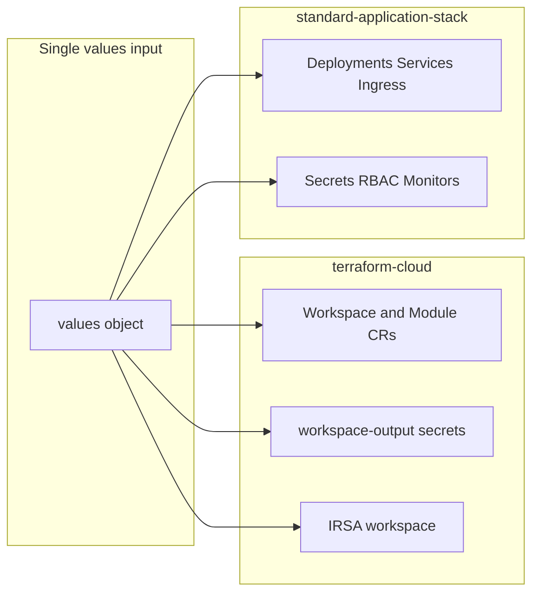

# Values and effects index

Per-key lookup of what changing each Helm value affects in `standard-application-stack` and `terraform-cloud`. Complements the feature-oriented view in [feature-documentation-spec.md](feature-documentation-spec.md) (use that doc for intent → values, constraints, and interactions).

For defaults and types, prefer the chart `values.yaml` files.

## How the two charts are used together

A Tanka-based repo typically passes the **same** values object into both charts and writes all manifests to one folder.

- **terraform-cloud** — Terraform Cloud Workspace/Module CRs and (when `global.terraform.externalSecrets` is true) ExternalSecrets for workspace outputs and optional IRSA output.
- **standard-application-stack** — App workloads (Deployments/StatefulSets, Services, Ingress, Jobs, CronJobs, RBAC, secrets, monitors, etc.).

Define one shared `global` object and pass it to both charts.

---

## terraform-cloud: values and effects

**Templates:** [workspace.yaml](../charts/terraform-cloud/templates/workspace.yaml), [workspace-output-secret.yaml](../charts/terraform-cloud/templates/workspace-output-secret.yaml), [irsa-workspace.yaml](../charts/terraform-cloud/templates/irsa-workspace.yaml), helpers in [_helpers.tpl](../charts/terraform-cloud/templates/_helpers.tpl) and `templates/helpers/`.

### Global

| Value path | Effect |
|------------|--------|
| `global.name` | Fullname (when no `nameOverride`/component), instance naming, labels, default tags (Application/Component). |
| `global.owner` | Labels, default tags (Owner), workspace owner default. |
| `global.partOf` | Default tags (Project). |
| `global.clusterEnv` | Labels, default tags (env), `allow_destroy` default (prod/logs → false), env-based `defaultVarValues`. |
| `global.clusterName` | Used in IRSA vars when provided. |
| `global.clusterRegion` | Labels, instance naming. |
| `global.backstage.component` | Default tags (`backstage.io/component`) when `global.terraform.tags.addBackstageComponentTag` is true. |
| `global.terraform.organization` | Workspace spec (Terraform Cloud org). |
| `global.terraform.terraformVersion` | Default Terraform version for all modules. |
| `global.terraform.externalSecrets` | **Gate:** when true, workspace-output-secret.yaml renders ExternalSecrets for workspace outputs and optional IRSA secret. |
| `global.terraform.irsa` | Consumed by **standard-application-stack** only (switches IRSA role-name prefix); not used in terraform-cloud templates. |
| `global.terraform.agentPoolID` | Workspace agent pool. |
| `global.terraform.executionMode` | Workspace execution mode (e.g. agent). |
| `global.terraform.enableRestartedAt` | Module CR: include `restartedAt` for plan/apply triggers. |
| `global.terraform.restartedAt` | Module CR: explicit `restartedAt` when set. |
| `global.terraform.defaultWorkspaceAllowDestroy` | Default for allow_destroy when not set per instance. |
| `global.terraform.defaultApplyMethod` | Default apply method (e.g. auto). |
| `global.terraform.teamAccess` | Workspace team access block when set. |
| `global.terraform.tags.addBackstageComponentTag` | Include backstage tag in default tags. |
| `global.terraform.tags.addDeprecatedTags` | Include Owner, Project, Application, Component in default tags. |

### Root-level

| Value path | Effect |
|------------|--------|
| `nameOverride` | Fullname when set (overrides `global.name` when no component). |

### Resource blocks (same pattern for each)

Resource keys in `terraformCloudResources`: **activeMQ**, **apiGatewayHttp**, **auroraMySql**, **auroraPostgresql**, **bedrock**, **cmsBackup**, **datasync**, **dynamodb**, **extraIAM**, **glue**, **kinesis-firehose**, **lambda**, **mariadb**, **memcached**, **opensearch**, **postgresql**, **redis**, **s3**, **s3ReplicationRules**, **s3MultiRegionAccessPoint**, **sns**, **sqs**, **sshKeyPairSecret**, **staticWebsite**, **stepFunctionEks**.

(`irsa` is separate — see below.)

| Value path | Effect |
|------------|--------|
| `<resource>.enabled` | **Gate:** when true, one Workspace CR + one Module CR per instance. For opensearch, s3, s3MultiRegionAccessPoint, dynamodb, sns, sqs also drives `irsaRequired`. |
| `<resource>.outputSecret` | When true and `global.terraform.externalSecrets`, emits ExternalSecret(s) for that resource's outputs. |
| `<resource>.syncWave` | ArgoCD sync wave on Workspace/Module CRs (ExternalSecrets hardcode sync-wave `-20`). |
| `<resource>.eventBus.enabled` | (SNS/SQS) Event bus tag/behavior when set. |
| `<resource>.terraform.terraformVersion` | Override Terraform version for this module. |
| `<resource>.terraform.module.source` | Module registry path. |
| `<resource>.terraform.module.version` | Module version. |
| `<resource>.terraform.defaultVars` | Default TF variables for all instances. |
| `<resource>.terraform.instances` | Map of instance name → vars; one Workspace+Module per entry (or single `"default"`). Instance keys include workspaceNameOverride, workspaceTags, workspaceAllowDestroy, workspaceApplyMethod, moduleDestroyOnDeletion, workspaceOwner, outputSecretMap, plus module-specific vars. |

### IRSA

| Value path | Effect |
|------------|--------|
| `irsa.enabled` | **Gate:** when true, irsa-workspace.yaml renders IRSA Workspace + Module even if no other IRSA-requiring resource is enabled. |
| `irsa.nameOverride` | Overrides IRSA resource/name (root of `irsa`, not under `terraform`). |
| `irsa.terraform.*` | Module source/version, terraformVersion, vars, notifications. |
| `irsa.terraform.vars.output_secret_name` | When set and `externalSecrets` true, triggers one ExternalSecret for IRSA output (does not require `irsa.enabled`). |
| `jobs` | Job names used to build `k8s_extra_service_accounts` as `{global.name}-{job.name}`. |
| `s3MultiRegionAccessPoint.enabled` + instances | When IRSA is rendered, injects `lookup_multi_region_access_points`. |

### Conditional manifests (terraform-cloud)

| Manifest | Condition |
|----------|-----------|
| Workspace + Module CRs per resource | `.<resource>.enabled` |
| ExternalSecrets (workspace outputs) | `global.terraform.externalSecrets` and `.<resource>.enabled` and `.<resource>.outputSecret` |
| IRSA Workspace + Module | `irsa.enabled` **or** any of opensearch, s3, s3MultiRegionAccessPoint, dynamodb, sns, sqs `.enabled` |
| IRSA ExternalSecret | `global.terraform.externalSecrets` and `irsa.terraform.vars.output_secret_name` set |

---

## standard-application-stack: values and effects

**Templates:** under [templates/](../charts/standard-application-stack/templates/) and [templates/helpers/](../charts/standard-application-stack/templates/helpers/).

### Global and identity

| Value path | Effect |
|------------|--------|
| `global.name` | Fullname, labels, selector labels, default application/component. |
| `global.owner` | Labels (`app.mintel.com/owner`). |
| `global.application` / `global.component` | Common labels (defaults to `global.name`). Selector `component` uses context/root `component`, not `global.component`. |
| `global.partOf` | Selector label `app.kubernetes.io/part-of`. |
| `global.additionalLabels` | Merged into common labels. |
| `global.clusterEnv` | Labels, env; local vs non-local gates (secrets, network policy, VPA, monitors, Entra, KEDA, oauth sidecar, …). |
| `global.clusterRegion` | Labels, env. |
| `global.terraform.externalSecrets` | When true, SAS does **not** create ExternalSecrets for most backends (mariadb, postgresql, redis, s3, dynamodb, opensearch, …); terraform-cloud does. **Exception: elasticsearch** — SAS still creates it when enabled. |
| `global.terraform.irsa` | With `serviceAccount.irsa.enabled` and non-local: switches hardcoded role-arn prefix (`app-iam-…` vs `…`). Does not pull ARN from a TF secret. |
| `nameOverride` | Overrides fullname (trunc 63). |
| `partOf` / `component` | Override for selector/component label. |
| `additionalLabels` | Merged into labels (root-level). |

### Workload

| Value path | Effect |
|------------|--------|
| `replicas` | Deployment/StatefulSet when not autoscaling; also feeds PDB / topology / affinity gates (uses root `replicas`, not KEDA min). |
| `minReadySeconds` | Deployment only (not StatefulSet). |
| `statefulset` | StatefulSet vs Deployment; volumeClaimTemplates; skips standalone pvcs.yaml. |
| `singleReplicaOnly` | Replicas forced to 1; Recreate strategy; OPA `opa-allow-single-replica`. |
| `allowSingleReplica` | OPA `opa-allow-single-replica`; allows `replicas: 1` with RollingUpdate. |
| `image` / `imagePullSecrets` | Container image and pull secrets. |
| `port` / `extraPorts` | Container ports (extraPorts on container need `port` set); Service; ingress/network-policy. |
| `command` / `args` / `env` / `main.env` / `envFrom` | Main container config (`main.env` is main-only; celery inherits root `env` but not `main.env`). |
| `resources` / `securityContext` / `podSecurityContext` | Resources and security. |
| `liveness` / `readiness` / `terminationGracePeriodSeconds` | Probes; OPA skip annotations when disabled; grace period vs ALB preStop. |
| `lifecycle` / `ingress.alb.preStopDelay` | Lifecycle hooks; ALB preStop mutually exclusive with custom lifecycle when ingress + preStop enabled. |
| `strategy` | Deployment update strategy; singleReplicaOnly forces Recreate. |
| `topologySpreadConstraints` / `affinity` | Spread and anti-affinity (see feature doc; requires enabled + replicas > 1). |
| `extraInitContainers` / `extraContainers` | Init and extra containers. |
| `volumes` / `volumeMounts` / `persistentVolumes` | Volumes and PVCs. |
| `priorityClassName` / `useHostNetwork` | Pod priority (non-local); host network. |
| `podAnnotations` | Defined in values but **not wired** in templates. |
| `cronjobsOnly` / `jobsOnly` | Hide main Deployment/StatefulSet, Service, main PDB, main VPA, main ServiceMonitor. |

### Service, ingress, NLB

| Value path | Effect |
|------------|--------|
| `service.enabled` | Service; when false + metrics + not local → PodMonitor instead of ServiceMonitor. |
| `ingress.enabled` | Ingress resource(s); `tier: frontend` when enabled or `allowFrontendAccess`. |
| `ingress.tls` / `defaultHost` / `extraHosts` / `extraIngresses` / `ingress.alb` | Hosts, TLS, ALB annotations, API gateway when scheme=`api`. |
| `ingress.allowFrontendAccess` | `tier: frontend` without ingress. |
| `nlb.enabled` | Service type LoadBalancer with NLB annotations. |
| `networkPolicy.enabled` | NetworkPolicy when not local. |
| `oauthProxy.*` | Auth sidecar (non-local), Service ports 4180/9090, Ingress backend port, secrets. |

### Scaling and resilience

| Value path | Effect |
|------------|--------|
| `podDisruptionBudget.*` | Main PDB when enabled and replicas/minReplicaCount > 1; celery PDB separately. |
| `autoscaling.enabled` | Omits workload `replicas` whenever true; ScaledObject only when also not local. |
| `autoscaling.*` | min/max (clamped), triggers, Mimir, enableZeroReplicas, fallback, etc. |
| `verticalPodAutoscaler.*` | VPA when not local; **main** VPA also gated by not cronjobsOnly/jobsOnly; other instances use their own feature gates. |

### Identity and RBAC

| Value path | Effect |
|------------|--------|
| `serviceAccount.create` | Creates ServiceAccount (name alone does not create). |
| `serviceAccount.name` | SA name / reference. |
| `serviceAccount.irsa.enabled` / `nameOverride` | Hardcoded role-arn annotation when enabled and not local. |
| `serviceAccount.roles` / `clusterRoles` | Role/ClusterRole bindings when create true. |
| `kubelock.enabled` | Kubelock Role + RoleBinding when `serviceAccount.create`. |

### Secrets and backends

| Value path | Effect |
|------------|--------|
| `externalSecret.*` / `extraSecrets` | Main app ExternalSecret; local Secret in local env. |
| `mariadb` / `postgresql` / `redis` / `s3` / `dynamodb` / `sqs` / `opensearch` | Secret refs; ExternalSecrets when **not** `global.terraform.externalSecrets`. |
| `elasticsearch` | Secret refs; ExternalSecret/Secret created by SAS even when `global.terraform.externalSecrets` is true. |
| `oauthProxy` | Sidecar + secret (see networking). |

### Celery, cronjobs, jobs

| Value path | Effect |
|------------|--------|
| `celery.*` / `celeryBeat.*` | Worker, beat, exporter; PDB; monitors; VPA. Independent of cronjobsOnly/jobsOnly. |
| `cronjobs.jobs` / `cronjobs.defaults` | CronJob list; `enableDoNotDisrupt` from **defaults only**. |
| `jobs` / `jobDefaults` | Job list; `enableDoNotDisrupt` per job or default; job-specific SA when kubelock/irsa enabled. |

### Observability, sidecars, Entra, configmaps

| Value path | Effect |
|------------|--------|
| `metrics.*` | ServiceMonitor or PodMonitor when not local. |
| `otel.*` | OTEL env on **main** Deployment only (not celery). |
| `filebeatSidecar` / `gitSyncSidecar` | Sidecars (git-sync is a sidecar, not init). |
| `localstack` / `mailhog` | Local-gated env helpers. |
| `eventBus` | Env injection when enabled (any clusterEnv). |
| `entra.*` | Entra CRs; ingress RBAC; optional client secrets. |
| `configMaps` | ConfigMap resources and reloader annotations. |

### Conditional manifests (standard-application-stack)

| Manifest | Condition |
|----------|-----------|
| Main Deployment/StatefulSet | not `cronjobsOnly` / `jobsOnly` |
| Service | `service.enabled` and not cronjobsOnly/jobsOnly |
| Ingress | `ingress.enabled` |
| Main PDB | `podDisruptionBudget.enabled` and (replicas > 1 or KEDA minReplicaCount > 1) and not cronjobsOnly/jobsOnly |
| KEDA ScaledObject | `autoscaling.enabled` and not local |
| Main VPA | not local; not cronjobsOnly/jobsOnly; instance enabled |
| Other VPAs | not local; per-workload feature gates (celery, etc.) |
| Backend ExternalSecrets (most) | **not** `global.terraform.externalSecrets` (and not local where applicable) |
| Elasticsearch ExternalSecret | `elasticsearch.enabled` (independent of `global.terraform.externalSecrets`) |
| ServiceMonitor | service enabled, not cronjobsOnly/jobsOnly, not local, metrics enabled |
| PodMonitor | service disabled, not local, metrics enabled |

---

## Values authoring checklist

- One Jsonnet values object matching both `values.yaml` structures; same values feed both charts.
- One shared `global` definition.
- Respect gates: `externalSecrets`, IRSA, cronjobsOnly/jobsOnly, per-resource `enabled`, `clusterEnv` local vs non-local.
- terraform-cloud: enable resource blocks; set `outputSecret` when secrets are needed; IRSA when `irsa.enabled` or an IRSA-requiring resource is enabled.
- standard-application-stack: matching backend `.enabled` for secret injection; do not rely on `replicas` when autoscaling; consistent `global.terraform.externalSecrets`.
- For constraints and recipes, see [feature-documentation-spec.md](feature-documentation-spec.md).

## Related files

- [charts/terraform-cloud/values.yaml](../charts/terraform-cloud/values.yaml)
- [charts/standard-application-stack/values.yaml](../charts/standard-application-stack/values.yaml)
- [feature-documentation-spec.md](feature-documentation-spec.md)
